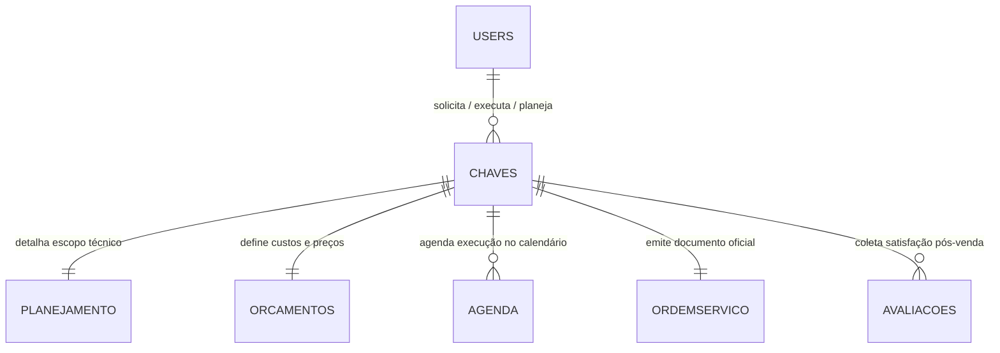
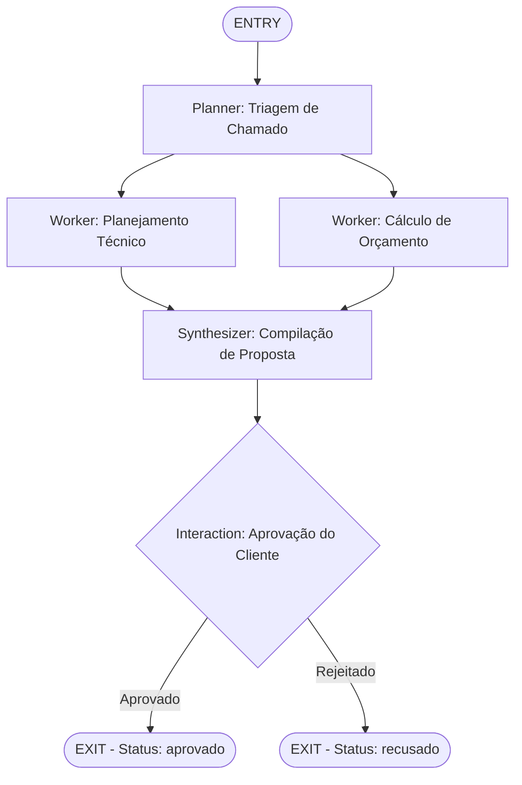
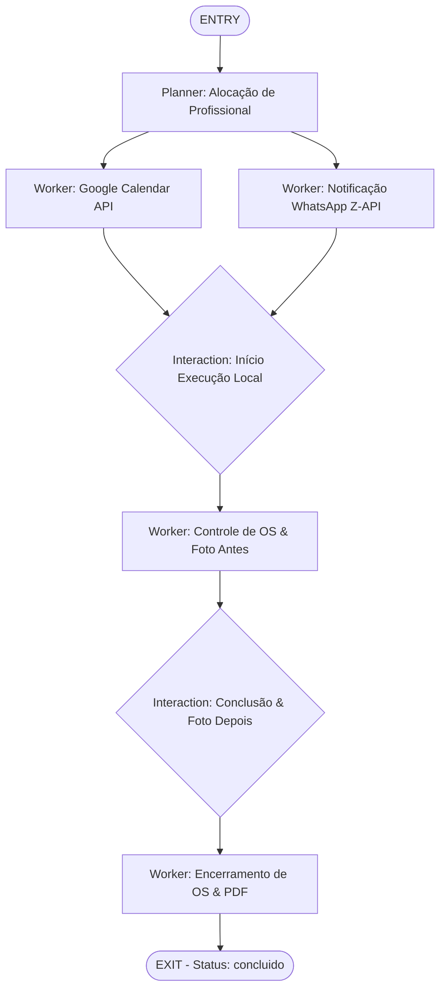
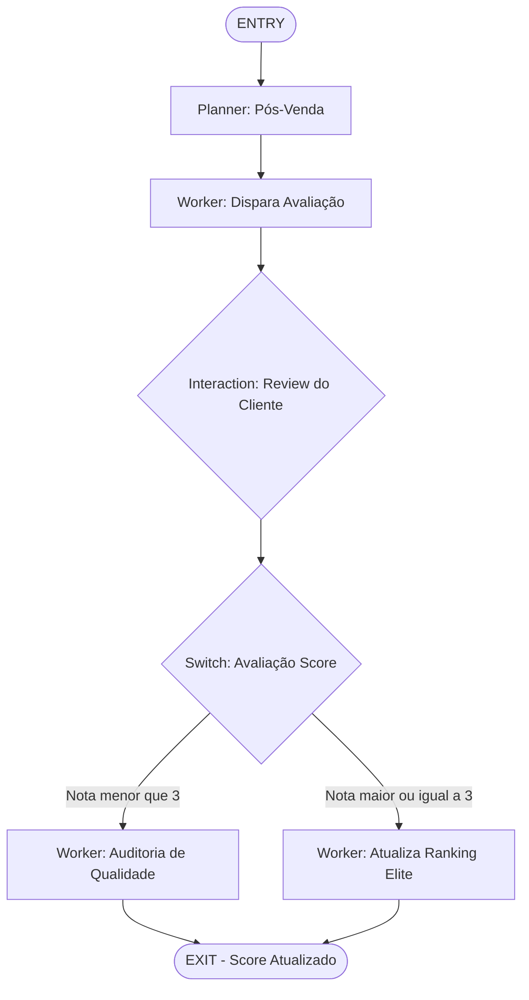

# Desenho da Engenharia de Grafos (Graph Engineering) - UAI-Fix

Este documento apresenta a visualização gráfica e arquitetura de dados baseada em Grafos de Tarefas e Conhecimento para o sistema **UAI-Fix**.

---

## 📊 1. Knowledge Graph (Grafo de Conhecimento das Entidades)

O diagrama abaixo ilustra as relações e integridade referencial entre as tabelas do banco de dados (Supabase) mapeadas para a tomada de decisão da IA.

---

## 🔄 2. Task Graphs (Fluxos de Processos e Workflows)

### Grafo A: Solicitação e Planejamento Técnico/Financeiro
Este fluxo paralisa o fluxo principal para planejar e orçar serviços simultaneamente, requerendo a aprovação do consumidor antes de agendar o profissional.

---

### Grafo B: Agendamento e Execução Física do Serviço
Este fluxo cuida da alocação de profissionais qualificados na cidade correspondente, sincronização do calendário e acompanhamento da OS por meio de fotos antes/depois da atividade.

---

### Grafo C: Pós-Venda, Controle de Qualidade e Auditoria
O pós-venda utiliza regras baseadas no score dado pelo cliente. Casos com notas baixas geram alarmes e mudam o status para revisão pelo Gestor.

