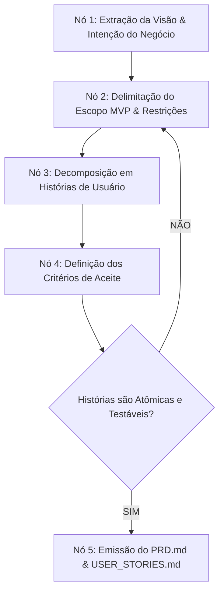
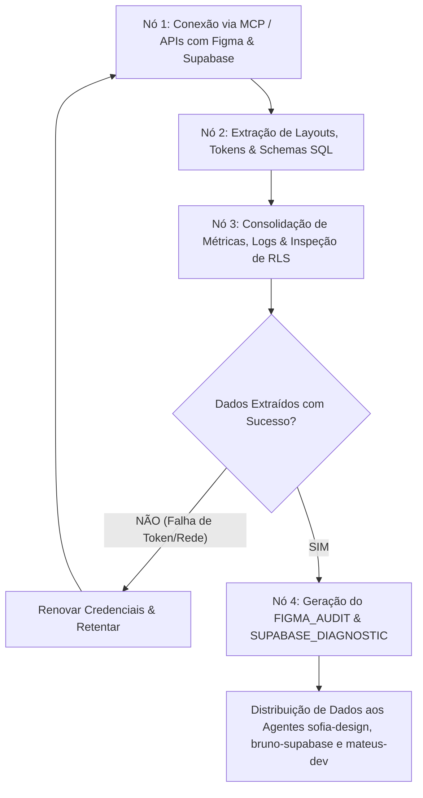
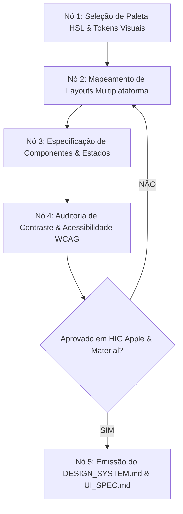
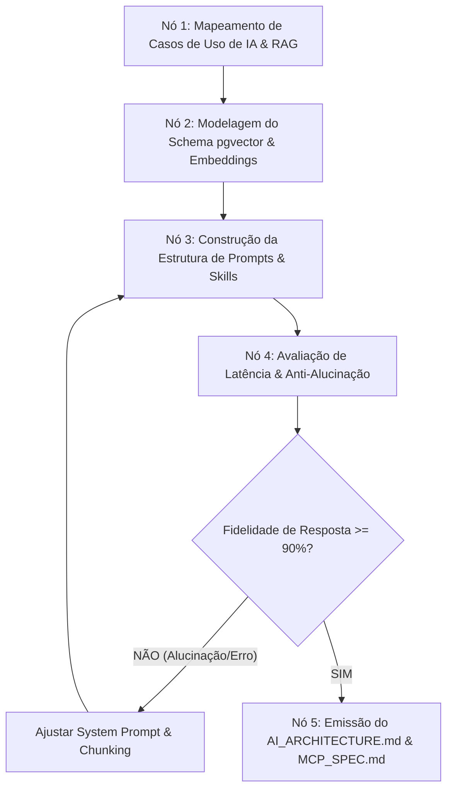
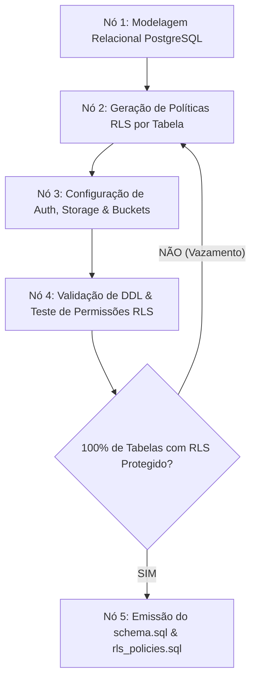
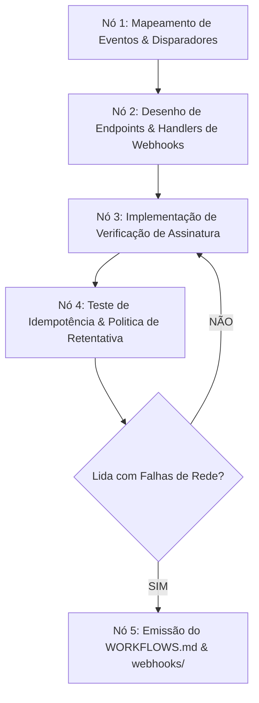
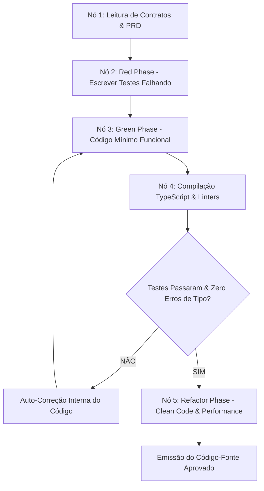
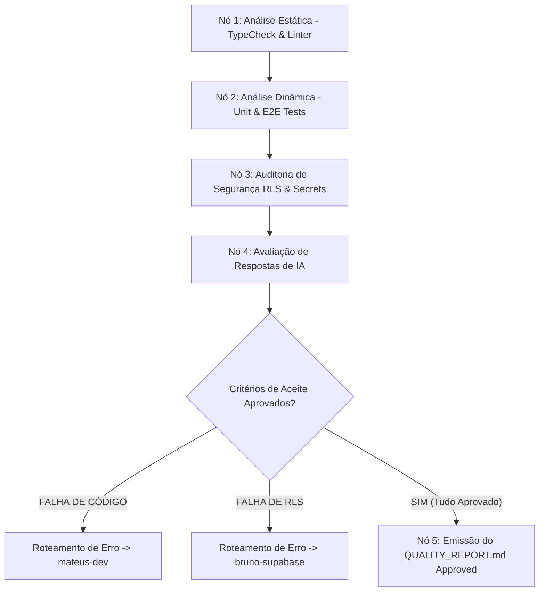

# Especificação de Micro-Grafos dos 9 Agentes do Squad

Este documento contém o **mapeamento detalhado dos Micro-Grafos Internos** de cada um dos 9 especialistas do **Universal Multiplatform & AI Systems Squad**. 

Utilize estes diagramas para compreender o fluxo interno de decisão de cada agente e identificar pontos exatos de otimização no desenvolvimento.

---

## 1. Micro-Grafo: `pedro-pm` (Product Manager)



---

## 2. Micro-Grafo: `fernando-reports` (Plataformas Externas, Figma, Supabase & Relatórios)



**Pontos de Otimização no `fernando-reports`:**
- **Nó 1 (Conexão MCP):** Automatizar reconexão silenciosa com o servidor Figma MCP e Supabase REST/GraphQL.
- **Nó 4 (Relatórios):** Estruturar em JSON + Markdown para consumo tanto por humanos quanto por agentes downstream.

---

## 3. Micro-Grafo: `sofia-design` (UX/UI & Design Specialist)



---

## 4. Micro-Grafo: `marcos-ai` (AI & Agentic Systems Architect)



---

## 5. Micro-Grafo: `bruno-supabase` (Supabase & Cloud Architect)



---

## 6. Micro-Grafo: `lucas-automation` (Automation & Workflow Specialist)



---

## 7. Micro-Grafo: `mateus-dev` (Lead Universal Developer - Ciclo TDD)



---

## 8. Micro-Grafo: `carla-qa` (QA, Refactoring & Security Gatekeeper)



---

## 9. Micro-Grafo: `diego-devops` (DevOps & Multi-Deploy Specialist)

```mermaid
graph TD
    V1[Nó 1: Validação de Variáveis de Ambiente & Segredos] --> V2[Nó 2: Execução de Build Vercel / EAS / Desktop]
    V2 --> V3[Nó 3: Teste de fumaça (Smoke Test) pós-deploy]
    V3 --> V_COND{Build & Deploy Aprovados?}
    V_COND -- "NÃO" --> V_FIX[Ajustar Configuração / Flags de Build]
    V_FIX --> V2
    V_COND -- "SIM" --> V4[Nó 4: Publicação de Release & Tagging]
```
