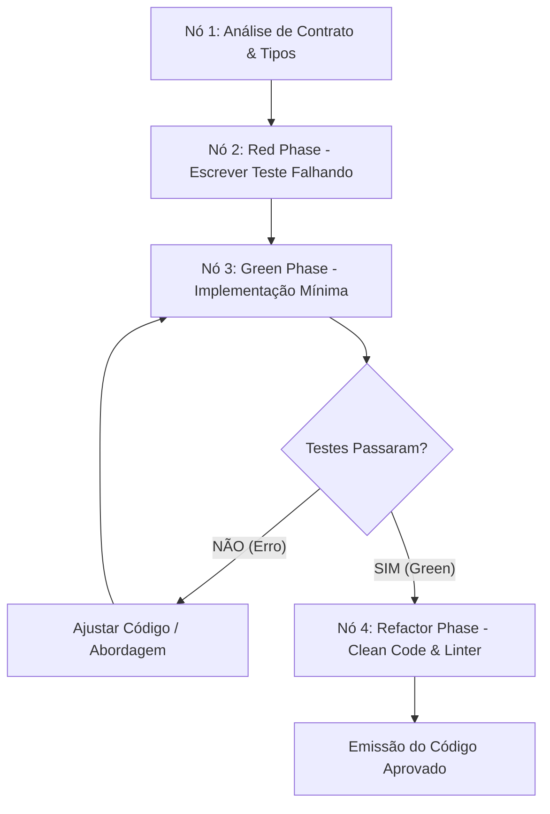
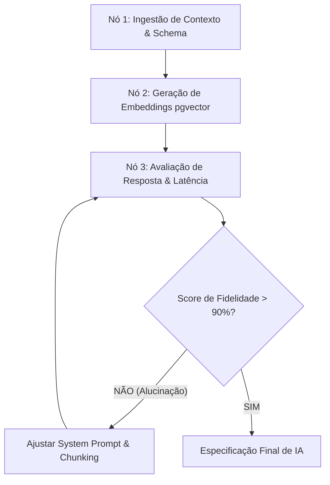
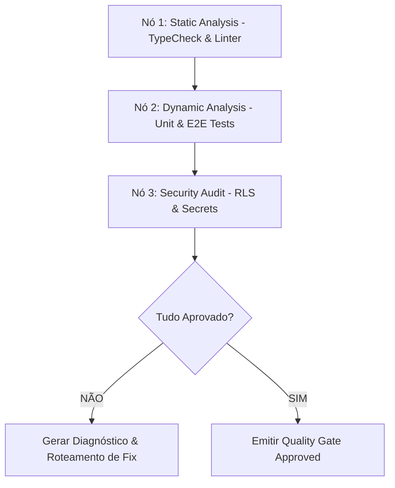

# BMAD-Graph Engine: Macro e Micro Grafos de Agentes

O **BMAD-Graph Engine** suporta **Engenharia de Grafos em Dois Níveis Simultâneos**: o **Macro-Grafo de Squad** (entre agentes) e os **Micro-Grafos Internos de Sub-Ciclos** (dentro de cada agente).

---

## 1. Macro-Grafo (Orquestração Inter-Agentes)
Orquestra o fluxo de alto nível entre os 8 agentes especialistas com execução paralela na Fase M e feedback loops na Fase D.

---

## 2. Micro-Grafos Internos (Sub-Ciclos Intra-Agentes)

Cada agente especialista executa um **Micro-Grafo Interno de Decisão** durante seu ciclo autônomo de trabalho:

### A. Micro-Grafo do `mateus-dev` (Ciclo TDD Interno)

### B. Micro-Grafo do `marcos-ai` (Ciclo de IA & RAG Interno)

### C. Micro-Grafo da `carla-qa` (Ciclo de Auditoria & Security Interno)

---

## Vantagens dos Micro-Grafos Internos
- **Auto-Correção Local (Self-Healing Loop):** O agente tenta corrigir pequenos erros internamente antes de emitir o entregável para a próxima fase.
- **Raciocínio Estruturado:** Cada sub-tarefa passa por nós explícitos de validação interna.
- **Transparência Rastreável:** O log do agente registra a transição exata entre seus nós internos.

